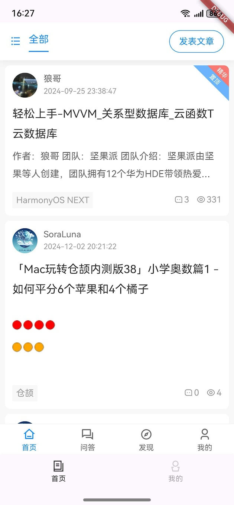

# 鸿蒙 Flutter 实战：现有 Flutter 项目支持鸿蒙 II

## 引言

在之前的文章[鸿蒙Flutter实战：09-现有Flutter项目支持鸿蒙](https://gitee.com/zacks/awesome-harmonyos-flutter/blob/master/%E9%B8%BF%E8%92%99%20Flutter%20%E5%AE%9E%E6%88%98/%E9%B8%BF%E8%92%99Flutter%E5%AE%9E%E6%88%98%EF%BC%9A09-%E7%8E%B0%E6%9C%89Flutter%E9%A1%B9%E7%9B%AE%E6%94%AF%E6%8C%81%E9%B8%BF%E8%92%99.md)中，介绍了如何改造项目，适配鸿蒙平台。

文中讲述了整体的理念和思路，本文更进一步，结合可实操的项目代码，详细说明如何实施。

通过模块化、鸿蒙壳工程，结合 FVM 管理多版本 Flutter SDK，最终，保持原 Flutter 代码纯净，最小化修改，完成了鸿蒙化的适配示例。

本项目代码地址: https://gitee.com/zacks/flutter-ohos-demo

## 准备工作

### 1.安装 FVM 和 melos

安装 [FVM](https://fvm.app/)，更多安装方式参考 fvm 官方文档

```bash
curl -fsSL https://fvm.app/install.sh | bash
```

安装[melos](https://melos.invertase.dev/)

```bash
dart pub global activate melos
```

### 2.使用 FVM 安装 Flutter SDK

分别安装官方的3.22版本，以及[鸿蒙社区的 3.22.0](https://gitee.com/harmonycommando_flutter/flutter) 版本

### 3.搭建 Flutter鸿蒙开发环境

参考文章《鸿蒙Flutter实战：01-搭建开发环境》


## 搭建项目架构

### 创建目录

```bash
# 创建项目目录
mkdir flutter-ohos-demo
```

> 设置使用的 Flutter SDK 版本
> 推荐在 VsCode 的命令行中执行以下命令，这将创建 .fvm 目录, .vscode/setting.json 文件, 和.fvmrc 文件

```bash
fvm use 3.22.0
```
### 初始化工作区间

创建目录，项目结构如下所示：

```bash
.
├──  packages
│   ├── apps  #该目录用于存放各端应用壳工程
│   ├── common #该目录用于存放公共库，均为纯 dart 代码，不依赖于 ios/android 等原生实现
│   │   ├── domains #领域对象，存放各类实体文件，如枚举/模型/vo/事件等
│   │   ├── extensions #存放扩展类文件，对于类的扩展方法/属性
│   │   ├── services #服务类：如请求服务/授权服务/缓存服务/平台调用服务/路由服务/工具类等
│   │   └── widgets #通用小型 widgets, 纯dart编写的 Flutter UI 组件
│   ├── components #封装组件库，可以依赖于第三方库/第三方插件，或依赖于 plugins中的插件
│   │   ├── image_uploader
│   │   └── player
│   ├── modules
│   │   ├── address
│   │   ├── home
│   │   ├── me
│   │   ├── message
│   │   ├── order
│   │   ├── shop
│   │   └── support
│   └── plugins #插件库，自行封装的插件库，依赖于原生平台(ios/android)的代码
│       └── printer
├── README.md
├── melos.yaml
└── pubspec.yaml
```

### 运行 melos bootstrap

```
melos bootstrap
```

### 开始编写代码

在各个 package 初始化代码，如在 `packages/common/domains` 目录运行

```bash
fvm flutter create --template package .
```

## 创建壳工程

新建两个壳工程，一个为 app，另外一个为 ohos_app

### App 壳工程

进入 `package/apps/app` 目录, 创建 app 项目，该项目为一个 App 项目，用于各平台（ios/android/mac 等， 不包含鸿蒙）打包

```bash
fvm flutter create --template app --org com.moguyun.flutter app
```

#### 增加依赖项

修改 pubspec.yaml，添加以下内容

 ```yaml
  services:
    path: '../../common/services'
  domains:
    path:  '../../common/domains'
  widgets:
    path: '../../common/widgets'

  home:
    path: '../../modules/home'
  me:
    path: '../../modules/me'
  support:
    path: '../../modules/support'
 ```

#### 安装依赖

运行以下命令，安装依赖

 ```bash
fvm flutter pub get
 ```

### 鸿蒙壳工程

#### 切换鸿蒙 Flutter SDK

首先在 flutter-ohos-demo 项目根目录，将 Flutter 版本切换到鸿蒙化的版本

```
fvm use custom_3.22.0
```
> SDK 变更以后，需要重启 IDE (或者 Dart：Restart Analysis Server)，以便让 Flutter 插件重启

#### 创建 ohos_app 项目

进入 packages/apps 目录，创建 ohos_app 项目

```bash
fvm flutter create --template app --platforms ohos --org com.moguyun.flutter ohos_app
```

#### 增加依赖项

进入 packages/apps/ohos_app 目录中的 pubspec.yaml, 同样增加依赖项

 ```yaml
  services:
    path: '../../common/services'
  domains:
    path:  '../../common/domains'
  widgets:
    path: '../../common/widgets'

  home:
    path: '../../modules/home'
  me:
    path: '../../modules/me'
  support:
    path: '../../modules/support'
 ```

#### 三方库鸿蒙化适配

编辑 pubspec.yaml文件，增加以下配置，通过 dependency_overrides 来替换鸿蒙化的三方库，注意鸿蒙化的库与原库，保持版本统一

```
# 鸿蒙适配
dependency_overrides:
  flutter_inappwebview:
    git:
      url: https://gitee.com/openharmony-sig/flutter_inappwebview.git
      path: "flutter_inappwebview"
```

> 每次修改完 pubspec.yaml，使用 `fvm flutter pub get` 更新下依赖安装。


## 注意事项

1. melos.yaml 文件中的 `sdkPath: .fvm/flutter_sdk` 配置了 melos 使用的 flutter SDK 版本，即由FVM 配置的当前项目版本

2. 每次切换 Flutter SDK 时，都会修改文件 .fvm/, vscode/settings.json 文件

3. ohos_app/pubsec.yaml 中的 dependency_overrides, 仅添加需要鸿蒙化的三方库

4. ohos-3.22 在 build 时，有的 har 包可能确实，建议保持 ohos-Flutter 版本最新，如果还是不行，可以考虑手动复制 har 包（使用 3.7 构建出来）

如何判断三方库是否需要鸿蒙化，简而言之，如果三方库由纯 Dart 实现，则不需要单独适配，直接使用；如果三方库依赖系统底层实现，则需要鸿蒙化适配。

三方库的适配情况，可以查询 Gitee/Github，或者查阅表格 [Flutter三方库适配计划](https://docs.qq.com/sheet/DVVJDWWt1V09zUFN2)

5. 已知插件删除问题，如果删除插件，可能需要在ohos里面手动修改代码，移除相关依赖

`ohos/oh-package.json5`

## 应用截图

| 首页 | 我的 | 帮助 |
| ----------- | ----------- | ----------- |
|  |  |  |


## 总结

1. 通过 FVM 管理多个 Flutter SDK 版本，仅在鸿蒙调测打包时，切换到 ohos-flutter SDK
2. 通过 apps 壳工程，将鸿蒙化适配的代码，尽量在 ohos_app 项目中完成。通过 pub 包管理的 `dependency_overrides` 配置，逐个替换鸿蒙化的三方库
3. 通过 melos 管理多包项目，Flutter 项目进行模块化、组件化、插件化拆分，职责分离，平台抽象，不同平台组合打包，有效解决平台不一致问题

## 参考资料

- [鸿蒙Flutter实战：01-搭建开发环境](https://gitee.com/zacks/awesome-harmonyos-flutter/blob/master/%E9%B8%BF%E8%92%99%20Flutter%20%E5%AE%9E%E6%88%98/%E9%B8%BF%E8%92%99Flutter%E5%AE%9E%E6%88%98%EF%BC%9A01-%E6%90%AD%E5%BB%BA%E5%BC%80%E5%8F%91%E7%8E%AF%E5%A2%83.md)
- [鸿蒙Flutter实战：09-现有Flutter项目支持鸿蒙](https://gitee.com/zacks/awesome-harmonyos-flutter/blob/master/%E9%B8%BF%E8%92%99%20Flutter%20%E5%AE%9E%E6%88%98/%E9%B8%BF%E8%92%99Flutter%E5%AE%9E%E6%88%98%EF%BC%9A09-%E7%8E%B0%E6%9C%89Flutter%E9%A1%B9%E7%9B%AE%E6%94%AF%E6%8C%81%E9%B8%BF%E8%92%99.md)
- [Flutter三方库适配计划](https://docs.qq.com/sheet/DVVJDWWt1V09zUFN2)
- [flutter-ohos-demo项目代码](https://gitee.com/zacks/flutter-ohos-demo.git)